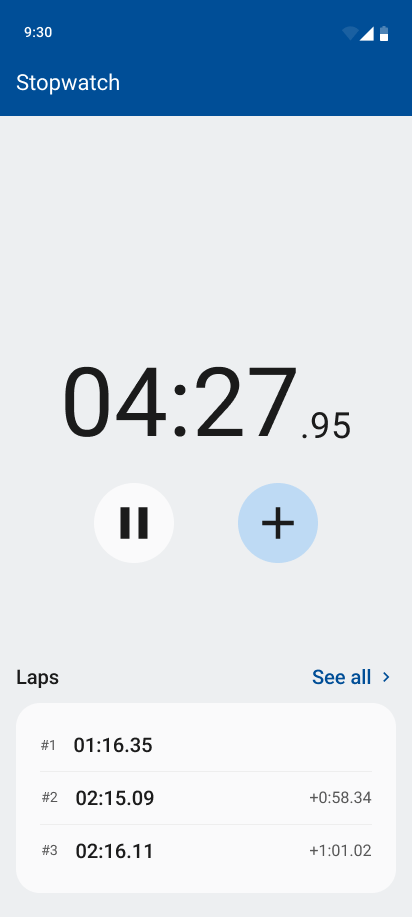

# Stopwatch

Android Stopwatch App

## Architecture

App UML diagram of an Unidirectional Dataflow Architecture

## Implementation

During architecture implementation, some exceptions were found:

- On Android, *ViewModel* depends on the platform because, the `ViewModel` superclass must
  be extended. Otherwise, coroutine scopes WILL NOT be lifecycle sensitive. This platform dependency
  prevents the *ViewModel* to be unit tested. Instrumentation tests are an alternative to unit
  tests.
