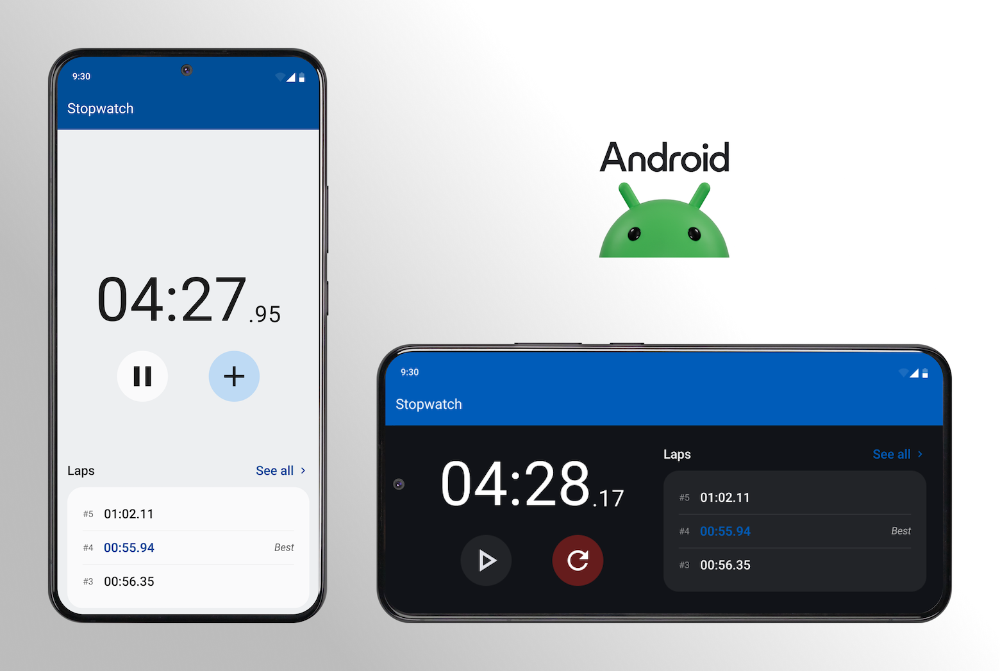
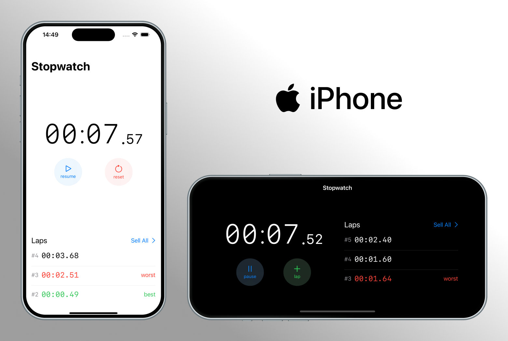
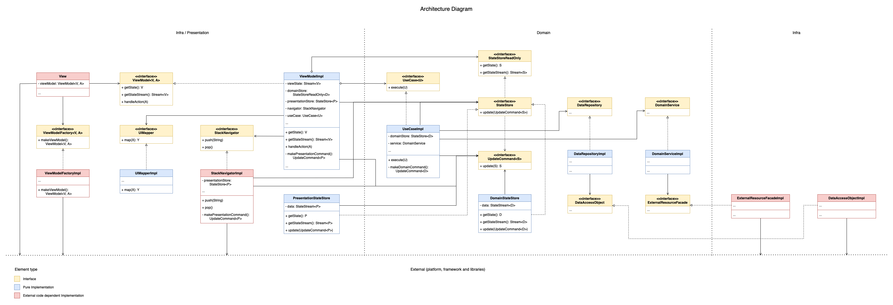

# Stopwatch

## Architecture

### Data Flow

### Architecture UML Diagram
App UML diagram of an Unidirectional Dataflow Architecture

## Implementation

During architecture implementation, some exceptions were found:

- On Android, *ViewModel* depends on platform specific code, because the
  `androidx.lifecycle.ViewModel` base class must be extended. Otherwise, coroutines won't be
  lifecycle sensitive, possibly leading to memory leaks or unwanted background process running.
- Instead of using **Command Pattern** to update *MutableStateStore*, lambdas were used.
  Thanks to closure, all command parameters can be implied from the lambda creation context.
