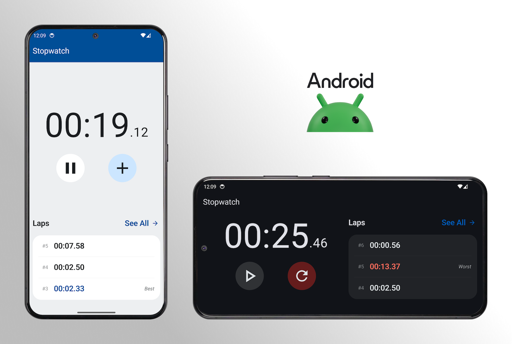
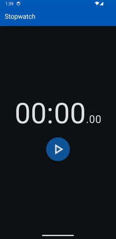

# Stopwatch

Stopwatch native Android and iOS applications implementing the same [architecture](#architecture).

## Operation

The Android and iOS implementations offer equivalent functionality while maintaining platform-specific visual identities. In addition to standard stopwatch operations (start, pause, reset and lap timing), the application persists its state on closure and restores it upon subsequent launch. Furthermore, a dedicated screen is provided for enhanced lap visualization.

## Architecture
The application architecture is explained in detail in [ARCHITECTURE.md](./docs/markdown/ARCHITECTURE.md).
