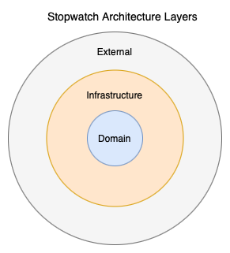
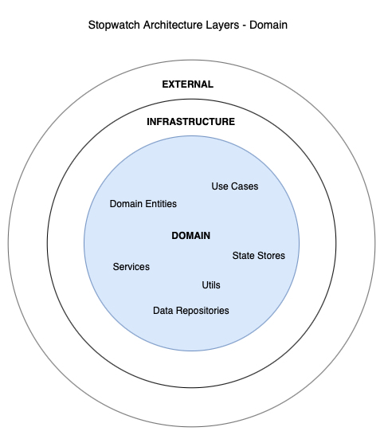
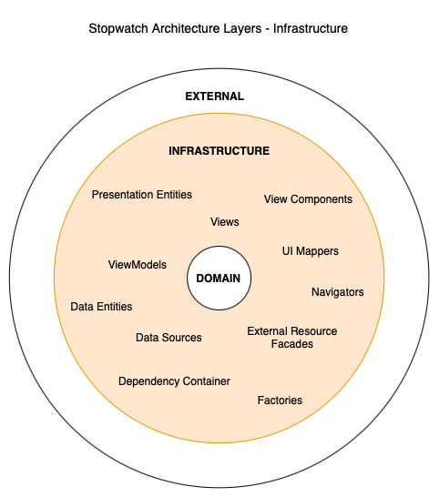
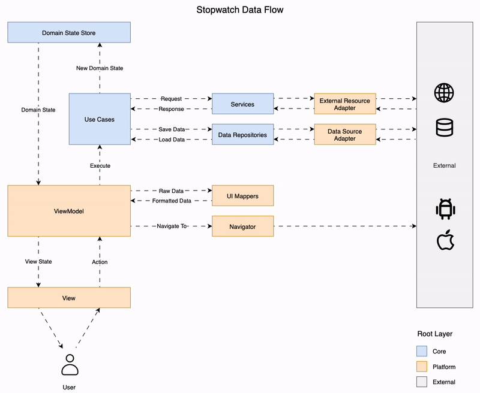

# Architecture

Table of contents
1. [Overview](#1-overview)
    - [1.1. Platform-Agnostic](#11-platform-agnostic)
2. [Layers](#2-layers)
    - [2.1. Domain](#21-domain)
      - [2.1.1. Domain Entities](#211-domain-entities)
      - [2.1.2. Use Cases](#212-use-cases)
      - [2.1.3. Services](#213-services)
      - [2.1.4. Data](#214-data)
        - [2.1.4.1. Data Repositories](#2141-data-repositories)
        - [2.1.4.2. State Stores](#2142-state-stores)
      - [2.1.5. Utils](#215-utils)
    - [2.2. Infrastructure](#22-infrastructure)
      - [2.2.1. Presentation](#221-presentation)
        - [2.2.1.1. Presentation Entities](#2211-presentation-entities)
        - [2.2.1.2. Views](#2212-views)
        - [2.2.1.3. View Components](#2213-view-components)
        - [2.2.1.4. ViewModels](#2214-viewmodels)
        - [2.2.1.5. UI Mappers](#2215-ui-mappers)
        - [2.2.1.6. Navigators](#2216-navigators)
      - [2.2.2. Data](#222-data)
        - [2.2.2.1. Data Entities](#2221-data-entities)
        - [2.2.2.2. Data Sources](#2222-data-sources)
      - [2.2.3. Services](#223-services)
        - [2.2.3.1. External Resource Facades](#2231-external-resource-facades)
      - [2.2.4. Dependency Injection](#224-dependency-injection)
        - [2.2.4.1. Dependency Container](#2241-dependency-container)
        - [2.2.4.2. Factories](#2242-factories)
      - [2.2.5. Application Entry Point](#225-application-entry-point)
    - [2.3. External](#23-external)
3. [Data Flow](#3-data-flow)
    - [3.1. User Interaction and View](#31-user-interaction-and-view)
    - [3.2. ViewModel and Action Handling](#32-viewmodel-and-action-handling)
    - [3.3. Navigation with Navigator](#33-navigation-with-the-navigator)
    - [3.4. Business Logic and Use Cases](#34-business-logic-and-use-cases)
    - [3.5. Domain State Store: The Single Source of Truth](#35-domain-state-store-the-single-source-of-truth)
    - [3.6. View State Updates and UI Mappers](#2215-ui-mappers)
4. [Dependency Diagram](#4-dependency-diagram)
5. [Folder Structure](#5-folder-structure)
6. [Implementation](#6-implementation-details)
    - 6.1. Android Implementation
    - 6.2. iOS Implementation
    - 6.3. Implementation Exceptions
7. [Tests](#7-tests)
    - 7.1. Android Tests
    - 7.2. iOS Tests
8. [Essential Concepts](#8-essential-concepts)
    - [8.1. Unified Modeling Language (UML)](#81-unified-modeling-language-uml)
    - [8.2. Clean Architecture](#82-clean-architecture)
    - [8.4. Unidirectional Data Flow (UDF)](#84-unidirectional-data-flow-udf)
    - [8.5. Dependency Inversion Principle (DIP)](#85-dependency-inversion-principle-dip)
    - [8.6. Design Patterns](#86-design-patterns)
      - [8.6.1. Abstract Factory](#861-abstract-factory)
      - [8.6.2. Facade](#862-facade)
      - [8.6.3. Observer](#863-observerj)
      - [8.6.4. Command](#864-command)

## 1. Overview
While seemingly simple, a stopwatch application poses a significant challenge in managing a high volume of rapidly occurring events. The implementation updates the stopwatch state every 10 milliseconds during operation, while concurrently handling user interactions. To address this demanding event processing requirement, the application leverages a [Unidirectional Data Flow (UDF)](#) pattern, ensuring predictable and efficient state management.

### 1.1. Platform-Agnostic
The architecture is designed to be platform-agnostic, promoting code reusability and maintainability across different platforms. This design principle was validated by implementing the architecture on both Android and iOS, demonstrating its adaptability and portability.

## 2. Layers
The architecture divides the application into three distinct layers: Domain, Infrastructure and External.



### 2.1. Domain
The Domain layer contains the core business logic and entities of the application, independent of any specific platform or framework. It represents the pure, platform-agnostic essence of the stopwatch functionality. The Domain layer contains elements like Domain Entities, Use Cases, Services, State Stores, Data Repositories and Utils.



#### 2.1.1. Domain Entities
Domain Entities represent the core data structures and types within the application. These data structures are primarily data containers, encapsulating the essential information without inherent behavior. They are utilized throughout the Domain layer and may also be accessed by the Infrastructure layer for platform-specific adaptations.

In the context of the stopwatch application, a Domain Entity representing the application state could be defined as follows:

```
enum StopwatchStatus:
  initial
  running
  paused

class StopwatchState:
  status: StopwatchStatus
  timeMilliseconds: Integer
```

#### 2.1.2. Use Cases
Use Cases encapsulate the core business logic of the application. They orchestrate operations by delegating tasks to Services and accessing data through State Stores and Data Repositories. Each Use Case focuses on a specific business operation, promoting modularity and maintainability. Even a simple application may comprise numerous, specialized Use Cases to address various functionalities.

The following code snippet demonstrates a potential implementation of a Use Case for starting a stopwatch:

```
class StartStopwatchUseCase:
  stateStore: StateStore<StopwatchState>
  timerService: TimerService

  execute():
    if stateStore.state.status == StopwatchStatus.initial:
      timerService.start() 
      newState = StopwatchState(status = running, timeMilliseconds = 0)
      stateStore.update(newState)
```

#### 2.1.3. Services
Domain Services encapsulate specialized business operations, often involving complex algorithms or interactions with external resources. Use Cases leverage Domain Services to delegate specific tasks or access specialized functionalities.

The following code snippet illustrates a potential implementation of a timer Domain Service:

```
class TimeState:
  isRunning: Boolean
  timeMilliseconds: Integer

class TimerService:
  state: TimerState

  start():
    if !state.isRunning:
      state = TimerState(isRunning = true, timeMilliseconds = 0)
      loop()

  loop():
    while state.isRunning:
      delay(milliseconds = 10)
      newTime = state.timeMilliseconds + 10
      state = TimerState(isRunning = state.isRunning, timeMilliseconds = newTime)

  pause():
  ...

  resume():
  ...

  reset():
  ...
```

#### 2.1.4. Data
The Domain Data layer comprises components that Use Cases utilize for updating application state or accessing external data sources. These components provide an abstraction layer, allowing Use Cases to interact with data without being tightly coupled to specific implementation details.

#### 2.1.4.1. Data Repositories
Data Repositories abstract data access for Use Cases, enabling local data persistence and potential integration with external Data Sources. They provide a well-defined interface, allowing Use Cases to interact with data without depending on specific implementation details. This abstraction promotes flexibility and maintainability by decoupling the business logic from the underlying data storage mechanisms.

The following code snippet demonstrates a potential implementation of a Data Repository for a weather application. This implementation retrieves weather information from two sources: a remote server and a local cache. If the remote server fails to provide predictions (e.g., due to network connectivity issues), the repository falls back to the local cache, providing the most recent predictions available for the specified date. This strategy ensures data availability even in offline scenarios, enhancing the application's resilience.

```
class WeatherRepository:
  cache: LocalWeatherDataSource
  server: RemoteWeatherDataSource

  getPredictionsForToday():
    today = Date()

    try:
      predicitons = server.getPredictions(date = today)
      cache.setPredictions(date = today, predictions = predictions)
    catch:
      // do nothing

    return cache.getPredictions(date = today)
```

#### 2.1.4.2. State Stores
State Stores serve as the single source of truth for application state, providing a centralized and consistent representation of data. Use Cases interact with State Stores to update and retrieve the application's state. To notify interested components about state changes, State Stores employ a publish-subscribe mechanism, often implemented using an Observer pattern-like approach. This allows components to react to state updates in a decoupled and efficient manner.

The following code snippet demonstrates a generic implementation of a State Store using the Observer pattern:

```
class Listener<T>:
  handleUpdate(newState: T)

class StateStore<T>:
  state: T
  listeners: Listener<T>[]

  updateState(newState: T):
    state = newState 
    for listener in listeners:
      listener.handleUpdate(state)

  addListener(listener: Listener<T>):
    if !listeners.contains(listener):
      listeners.add(listener)
  
  removeListener(listener: Listener<T>):
    if listernes.contains(listener)
      listeners.remove(listener)
```

#### 2.1.5. Utils
Utility classes and functions, often referred to as "Utils," provide reusable helper functionalities that can be accessed by various components across the application. These utilities typically encapsulate common operations or logic that are not specific to any particular domain or layer.

The following code snippet illustrates the types of functionalities that might be included within utility classes:

```
class DateUtils
  static diff(date1: Date, date2: Date) -> Date:
    diff = date1.toMilliseconds() - date2.toMilliseconds()
    return Date(milliseconds = Math.abs(diff))
  
// Usage
championshipMatch = Date(...) // some arbitrary date
today = Date()
remainingDate = DateUtils.diff(today, championshipMatch)
print("Remaining days: ", remainingDate.days)
```

### 2.2. Infrastructure
The Infrastructure (Infra) layer houses platform-specific implementations and dependencies on frameworks and libraries. It bridges the gap between the Domain layer and the external environment, providing platform-specific adaptations.  The Infrastructure layer contains Presentation elements, Data Sources, External Resource Facades, Dependency Injection classes and the Application's Entry Point. 



#### 2.2.1. Presentation
The Presentation layer exhibits platform-specific variations in its implementation. In some applications, it encompasses graphical user interface (GUI) elements, while in others, it may involve simple text-based input/output through a command-line interface (CLI). It could even be realized as a network protocol like HTTP. In the context of this stopwatch mobile application, the Presentation layer utilizes platform-specific GUI libraries for rendering data, handling user interactions, and managing navigation within the application. It encapsulates all the logic necessary for presentation, ensuring a clear separation of concerns from the underlying business logic and data access layers.

#### 2.2.1.1. Presentation Entities
Presentation Entities represent data structures and types that are shared and utilized by various components within the Presentation layer. These entities primarily serve as data containers, encapsulating information relevant to the presentation logic without inherent behavior. They promote consistency and maintainability by providing a unified representation of data across different parts of the user interface. Furthermore, Presentation Entities are tailored to represent data in a format that is most convenient for the View, facilitating efficient rendering and data binding.

The following code snippet illustrates an example of a Presentation Entity representing the stopwatch time:

```
class StopwatchViewTime:
  minutes: String[]
  seconds: String[]
  fraction: String[]
```

#### 2.2.1.2. Views
Views render the GUI, detect user interactions, and update based on ViewModel state changes via a Observer-like pattern. Their primary focus is display, delegating logic to the ViewModel.

The following code snippet demonstrates a basic counter View:

```
class CounterView:
  context: UiLibraryContext
  viewModel: CounterViewModel

  init():
    viewModel.addListener(this)

  render(state: CounterViewState):
    text = Text(value = state.count)
    button = Button(text = "Increment", onClick = handleIncrement)

    container = Column(alignment = "center", spacing = "10px")
    container.append(element = text)
    container.append(element = button)

    context.updateUI(element = container)

  handleIncrement():
    viewModel.handleAction(Action.Increment)

  handleUpdate(state: CounterViewState):
    render(state)
```

#### 2.2.1.3. View Components
View Components are reusable UI elements shared by multiple Views.

The following code snippet illustrates a simple button View Component:

```
class PrimaryButton:
  text: String
  onClick: () -> Void

  render():
    Button(
      text = text,
      onClick = onClick,
      color = Colors.primary,
      padding = "10px",
      border = "rounded"
    )
```

#### 2.2.1.4. ViewModels
A ViewModel connects the View to the application's business logic, acting as an intermediary that receives Action events from the View and processes them accordingly. It manages the View State for display and handles View Actions by delegating to Use Cases or Navigators. The ViewModel subscribes to the Domain State Store (Observer pattern) and updates the View State accordingly. It may delegate formatting to UI Mappers. Views observe ViewModel state changes.

The ViewModel is responsible for:
- Executing relevant Use Cases based on received Actions.
- Instructing the Navigator to transition between Views.
- Updating the View State to reflect data changes.

The following code snippet demonstrates a simple stopwatch ViewModel:

```
class StopwatchViewState:
  status: StopwatchState
  time: String

enum StopwatchAction:
  start
  pause
  resume
  reset
  seeDetails

class StopwatchViewModel:
  state: StopwatchViewState
  listeners: Listener[]
  stateStore: DomainStateStore

  startStopwatch: StartStopwatchUseCase
  pauseStopwatch: PauseStopwatchUseCase
  ResumeStopwatch: ResumeStopwatchUseCase
  ResetStopwatch: ResetStopwatchUseCase
  timeUiMapper: StopwatchTimeUiMapper
  navigator: Navigator

  init():
    stateStore.addListener(this)

  handleAction(action: StopwatchAction):
    switch action:
      case start: startStopwatch.execute()
      case pause: pauseStopwatch.execute()
      case resume: resumeStopwatch.execute()
      case reset: resetStopwatch.execute()
      case seetDetails: navigator.navigate(screen = "details") 

  handleUpdate(newState: DomainState):
    state = StopwatchViewState(
      status = newState.status,
      time = timeUiMapper.map(newState.timeMilliseconds)
    )

    for listener in listeners:
      listener.update(state)

  addListener(listener: Listener)
  ...

  removeListener(listener: Listener)
  ...
```

#### 2.2.1.5. UI Mappers
UI Mappers transform data into a format suitable for presentation, easing the ViewModel's formatting burden.

The following code demonstrates a stopwatch time UI Mapper:

```
class StopwatchTimeUiMapper:
  map(milliseconds: Integer) -> String:
    fraction = milliseconds / 10 % 100
    seconds = milliseconds / 1000 % 60
    minutes = milliseconds / 60000

    return format("%02d:02d.%02d", minutes, seconds, fraction)
```

#### 2.2.1.6. Navigators
Navigators handle screen transitions, relieving ViewModels of navigation logic. They typically wrap underlying UI library navigation code, adding convenience and abstracting implementation details.

The following code demonstrates a basic Navigator:

```
class Navigator:
  uiLibraryNavigator: UILibraryNavigator
  navigationStack: String[]

  navigate(screen: String):
    if screen in navigationStack:
      return

    navigationStack.append(screen)
    uiLibraryNavigator.navigate(screen)

  back():
  ...
```

#### 2.2.2. Data
The Infrastructure layer implements Data Sources defined in the Domain layer, connecting to external data resources and hiding platform-specific details. This promotes loose coupling and isolates the Domain layer from data access implementation specifics.

#### 2.2.2.1. Data Entities
Infrastructure Data Entities represent data structures used by third-party libraries for Data Source implementation, reflecting the library's data format and serialization.

The following code demonstrates an Infrastructure Data Entity. Note the introduction of third-party library specific code:

```
import Table, Column from database_library

class StopwatchStateEntity: Table(name = "stopwatch_state"):
  id: Column(name = "id", type = "INTEGER", primary = true) 

  status: Column(name = "status", type = "INTEGER", nullable = false)

  timeMilliseconds: Column(name = "time", type = "INTEGER", nullable = false)
```

#### 2.2.2.2. Data Sources
Data Sources provide an abstraction for Data Repositories to access external data persistence mechanisms, such as databases, files, or network services. Different implementations can be provided for the same interface, hiding data access details from the calling code.

The following code demonstrates a Data Source implementation for saving and restoring stopwatch state: 

```
import Connection from database_library

interface StopwatchStateDataSource:
  save(state: StopwatchState)
  load() -> StopwatchState?

class StopwatchStateDatabaseDataSource implements StopwatchStateDataSource:
  connection: Connection

  save(state: StopwatchState):
    entity = StopwatchStateEntity(
      id = 1,
      status = state.status.toInt(),
      timeMilliseconds = state.timeMilliseconds
    )
    
    connection.save(entity)
    
  load() -> StopwatchState?:
    entity = connection.findById(1)
    if entity == null:
      return null 

    return StopwatchState(
      status = Status.fromInt(entity.status),
      timeMilliseconds = entity.timeMilliseconds
    )
```

#### 2.2.3. Services
The Infrastructure Services layer provides concrete implementations for External Resource Facades defined in the Domain Services layer.

#### 2.2.3.1. External Resource Facades
External Resource Facades bridge the Domain Services layer with external resources, such as third-party libraries or operating system functionalities. This decouples the Services from external dependencies through the Facade pattern. 

The following code demonstrates an External Resource Facade of a email service:

```
// domain layer (domain/services/external_resources/EmailFacade)
class EmailMessage:
  from: String
  to: String
  subject: String
  body: String

interface EmailFacade:
  send(message: EmailMessage)


// infrastructure layer (infra/services/external_resources/EmailFacadeImpl) 
import MailService from third_party_email_library
import credentianls from infra/config/mail

class EmailFacadeImpl implements EmailFacade:
  mail = MailService(credentials = credentials)

  send(message: EmailMessage):
    mail.send(
      from = credentations.user, 
      to = message.to,
      subject = message.subject,
      body = message.body
    )
```

#### 2.2.4. Dependency Injection
The Dependency Injection layer manages resource initialization and object creation, primarily using Abstract Factories to decouple client code from concrete implementations.

#### 2.2.4.1. Dependency Container
The Dependency Container stores and provides dependencies required for object creation.

The following code illustrates an potential Dependency Container for a stopwatch application: 

```
class DataContainer:
  stopwatchRepository: StopwatchDataRepository
  stateStore: StateStore<StopwatchState>

class ServicesContainer:
  timer: TimerService

class UseCasesContainer:
  startStopwatch: StartStopwatchUseCase
  pauseStopwatch: PauseStopwatchUseCase
  resumeStopwatch: ResumeStopwatchUseCase
  resetStopwatch: ResetStopwatchUseCase

class PresentationContainer:
  navigator: Navigator
  timeUiMapper: TimeUiMapper

class StopwatchDependencyContainer:
  data: DataContainer
  services: ServicesContainer
  useCases: UseCasesContainer
  presentation: PresentationContainer

  init():
    data = DataContainer(
      stopwatchRepository = StopwatchDataRepositoryImpl(),
      stateStore = StateStoreImpl(StopwatchState())
    )

    services = ServicesContainer(
      timer = TimerServiceImpl()
    )

    useCases = UseCasesContainer(
      startStopwatch = StartStopwatchUseCaseImpl(data.stateStore, services.timer),
      pauseStopwatch = PauseStopwatchUseCaseImpl(data.stateStore, services.timer),
      resumeStopwatch = ResumeStopwatchUseCaseImpl(data.stateStore, services.timer),
      resetStopwatch = ResetStopwatchUseCaseImpl(data.stateStore, services.timer),
    )

    presentation = PresentationContainer(
      navigator = Navigator(),
      timeUiMapper = TimeUiMapper()
    )
```

#### 2.2.4.2. Factories
Factories decouple object creation from usage, typically implementing the Abstract Factory pattern and leveraging dependency injection. They are passed as arguments to consuming classes and functions.

The following code demonstrates a ViewModel Factory implementation:

```
class ViewModelFactory:
  container: StopwatchDependencyContainer

  make():
    return ViewModel(
      stateStore = container.data.stateStore,
      startStopwatch = container.useCases.startStopwatch,
      pauseStopwatch = container.useCases.pauseStopwatch,
      ResumeStopwatch = container.useCases.resumeStopwatch,
      ResetStopwatch = container.useCases.resetStopwatch,
      timeUiMapper = container.presentation.timeUiMapper,
      navigator = container.presentation.navigator
    )
```

#### 2.2.5. Application Entry Point
Application Entry Points differ significantly across platforms, ranging from a simple `main` function to complex class hierarchies. In Android, the entry point is the class specified in the `AndroidManifest.xml` file, while in iOS, it's a struct with the `@main` annotation. The Entry Point may reside in the project's root or within the infrastructure layer directory. The Application Entry Point is responsible for creating the dependency container and performing all necessary initializations.

### 2.3. External
The External layer represents the environment outside of the application's Domain and Infrastructure layers, encompassing the underlying platform, frameworks, and external libraries that the application relies upon for various functionalities. It acts as the interface between the application and the external world. This layer typically comprises a diverse set of components, including:

- **Operating System (OS)**: Provides fundamental services and resources, such as process management, memory allocation, and file system access.

- **Presentation Framework**: Handles the user interface and interaction, including UI elements, layout management, and event handling (e.g., Jetpack Compose, SwiftUI).

- **Persistence Mechanism**: Manages data storage and retrieval, encompassing databases (e.g., Room, SQLite), file systems, and other storage solutions.

- **Network Interfaces**: Facilitates communication with external systems and services, enabling data transfer and interaction with remote resources (e.g., Retrofit, OkHttp).

- **Dependency Injection (DI) Library**: Manages object creation and dependency resolution, promoting loose coupling and modularity (e.g., Hilt, Koin).

- **Third-Party Libraries**: Provides specialized functionalities, such as image loading, analytics, or payment processing, that are not part of the core application or platform (e.g., Glide, Firebase).

- **Hardware Interfaces**: Provides access to device hardware components, such as the camera, GPS, sensors, and Bluetooth.

- **Cloud Services**: Integrates with cloud-based platforms for services like data storage, authentication, and push notifications (e.g., AWS, Google Cloud, Azure).

- **System Services**: Provides access to platform-specific services, such as location services, notification management, and background tasks.
Security Frameworks: Provides security features such as encryption, authentication, and authorization.


## 3. Data Flow
The application's data flow usually begins with user interactions on the Graphical User Interface (GUI). These interactions trigger a series of processing steps, which result in data visualizations being presented back to the user through the GUI. This cyclical process is illustrated in the following diagram and described in detail by the subsequent sections:



### 3.1. User Interaction and View
The user interface (UI) is presented through Views, which are responsible for displaying information and handling user interactions. When a user interacts with a View (e.g., clicking a button), it emits an Action event. This event encapsulates relevant information about the interaction, such as Action.Start when the Start button is clicked.

### 3.2. ViewModel and Action Handling
The ViewModel acts as an intermediary between the View and the application logic. It receives Action events from the View and processes them accordingly. The ViewModel is responsible for:
- Executing relevant Use Cases based on the received Action.
- Instructing the Navigator to transition between different Views.
- Updating the View State to reflect changes in the application's data.

### 3.3. Navigation with the Navigator
The Navigator handles all screen navigation within the application. It interacts directly with the UI framework and libraries to manage View transitions and rendering. The ViewModel directs the Navigator to navigate to specific Views based on user actions or application logic.

### 3.4. Business Logic and Use Cases
Use Cases encapsulate the core business logic of the application. They may delegate tasks to Services for performing specilized operations or accessing external resources though the [Facade](#) pattern. Use Cases utilize Data Repositories to persist data beyond the application's lifecycle. During execution, Use Cases may update the application's state by emitting a new Domain State to the Domain State Store using the [Command](#) pattern.

### 3.5. Domain State Store: The Single Source of Truth
The Domain State Store serves as the central repository for the application's state. Components interested in state changes can subscribe to updates using the [Observer](#) pattern. This ensures that all parts of the application have a consistent view of the current state.

### 3.6. View State Updates and UI Mappers
The ViewModel subscribes to Domain State changes and updates the View State accordingly. To transform Domain State into a format suitable for display, the ViewModel utilizes UI Mappers. These mappers handle data transformations and ensure the View State is optimized for UI rendering. The View, also subscribing to View State changes, receives updates via the [Observer](#) pattern and refreshes its display.

## 4. Dependency Diagram
To minimize coupling between system components, all dependencies are mediated through interfaces. Furthermore, dependencies flow inward, originating from input/output components (e.g., GUI, data sources) and directed towards core domain logic and entities, aligning with principles of [Clean Architecture](#). When the flow of control necessitates a reversal of this dependency direction, the [Dependency Inversion Principle (DIP)](#) is applied. Additionally, to decouple object creation from utilization, the [Abstract Factory](#) pattern is employed. The relationships between application components are visualized in the following UML diagram:


## 5. Folder Structure
The Android and iOS applications were developed independently, utilizing the recommended languages and frameworks for each platform: [Kotlin with Jetpack Compose](https://developer.android.com/courses/android-basics-compose/course) for Android and [Swift with SwiftUI](https://developer.apple.com/tutorials/app-dev-training/) for iOS. Despite the technological differences, both implementations adhere to a common architecture and folder structure. The Android codebase resides in the `android` folder, while the iOS codebase is located in the `ios` folder.

The following diagram illustrates the application's folder structure:

```
-- src
   |-- domain
   |   |-- data
   |   |   |-- data_sources (interfaces)
   |   |   |-- repositories
   |   |   \-- stores
   |   |
   |   |-- entities
   |   |
   |   |-- services
   |   |   \-- external_resources (interfaces)
   |   |
   |   |-- use_cases
   |   |
   |   \-- utils
   | 
   \-- infra
       |-- data
       |   \-- [persistency library]
       |       |-- data_sources (implementations)
       |       \-- entities
       |
       |-- di
       |
       |-- presentation
       |   |-- entities
       |   |-- mappers
       |   |-- navigation
       |   |-- view_models
       |   |
       |   \-- [ui library]
       |       |--- components
       |       |--- navigation
       |       \--- views
       |
       \-- services
           \-- external_resources (implementations)

-- tests
```

While platform-specific nuances may influence the final implementation details, the overall project structure and organization should remain consistent across platforms.

## 6. Implementation 
During architecture implementation, some exceptions were found:

- On Android, *ViewModel* depends on platform specific code, because the
  `androidx.lifecycle.ViewModel` base class must be extended. Otherwise, coroutines won't be
  lifecycle sensitive, possibly leading to memory leaks or unwanted background process running.
- Instead of using the [Command](#764-command) pattern to update the Domain State Store, lambdas were applied.
  Thanks to closure, all command parameters can be implied from the lambda's creation context.
  
## 7. Tests
Unit tests were implemented for Use Cases, ViewModels, and UI Mappers, leveraging the respective testing frameworks for Android (i.e., JUnit) and iOS (i.e., XCTest). The testing strategy focused on covering critical logic within these components, prioritizing areas with higher potential for errors. This approach aims to ensure the quality and reliability of core application functionalities.
For more information about unit testing on a specific platform, check the following guides:
- [Unit tests on Android](https://developer.android.com/training/testing/local-tests)
- [Unit test on iOS](https://developer.apple.com/documentation/xcode/adding-tests-to-your-xcode-project)

## 8. Essential Concepts

### 8.1. Unified Modeling Language (UML)
Unified Modeling Language (UML) is a standardized visual modeling language used to specify, visualize, construct, and document the artifacts of software systems. It provides a set of diagrams and notations for representing various aspects of a system, including its structure, behavior, and interactions. [Read more](https://www.geeksforgeeks.org/unified-modeling-language-uml-class-diagrams/).

### 8.2. Clean Architecture
Clean Architecture Clean Architecture is a software design philosophy that emphasizes the separation of concerns and the independence of the core business logic from external frameworks and infrastructure. It promotes a layered architecture where dependencies flow inward, from outer layers like the UI and databases, towards the inner core domain logic. [Read more](https://blog.cleancoder.com/uncle-bob/2012/08/13/the-clean-architecture.html).

### 8.4. Unidirectional Data Flow (UDF)
Unidirectional Data Flow (UDF) is an architectural pattern where data flows in a single direction, creating a predictable and manageable data flow within an application. It typically involves components like views, view models, and data stores, with data flowing from the View to the ViewModel and updates propagating back through defined channels. UDF simplifies state management, reduces complexity, and enhances the testability of applications. [Read more](https://developer.android.com/develop/ui/compose/architecture#udf).

### 8.5. Dependency Inversion Principle (DIP)
Dependency Inversion Principle (DIP) is a software design principle that promotes loose coupling between components by inverting the direction of dependencies. Instead of high-level modules depending on low-level modules, both depend on abstractions (interfaces). This allows for greater flexibility, maintainability, and testability by enabling components to be easily swapped or modified without affecting other parts of the system. [Read more](https://en.wikipedia.org/wiki/Dependency_inversion_principle).

### 8.6. Design Patterns 
Design Patterns Design patterns are reusable solutions to recurring design problems in software development. They provide proven approaches for structuring code, managing dependencies, and implementing common functionalities. Design patterns are categorized into creational, structural, and behavioral patterns, each addressing a specific type of design challenge. [Read more](https://refactoring.guru/design-patterns/what-is-pattern).

#### 8.6.1. Abstract Factory
The Abstract Factory pattern provides an interface for creating families of related or dependent objects without specifying their concrete classes. It allows for the creation of objects without knowing their specific types, promoting flexibility and loose coupling. This pattern is useful when a system needs to support multiple variations of objects or when the concrete types of objects should be determined at runtime. [Read more](https://refactoring.guru/design-patterns/abstract-factory).

#### 8.6.2. Facade
The Facade pattern provides a simplified interface to a complex subsystem, hiding its internal complexities and making it easier to use. It acts as a single point of entry for interacting with the subsystem, reducing dependencies and improving code clarity. This pattern is useful when working with large or complex libraries or when you want to provide a simplified API for a specific use case. [Read more](https://refactoring.guru/design-patterns/facade).

#### 8.6.3. Observer
The Observer pattern defines a one-to-many dependency between objects, where one object (the subject) notifies all its dependents (observers) of any state changes. This allows for loose coupling between objects, as the subject doesn't need to know the specific types of its observers. This pattern is commonly used for event handling, notifications, and data synchronization.[Read more](https://refactoring.guru/design-patterns/observer).

#### 8.6.4. Command
The Command pattern encapsulates a request as an object, thereby letting you parameterize clients with different requests, queue or log requests, and support undoable operations. It decouples the object that invokes the operation from the one that knows how to perform it. This pattern is useful for implementing undo/redo functionality, transaction management, and macro recording. [Read more](https://refactoring.guru/design-patterns/command).
