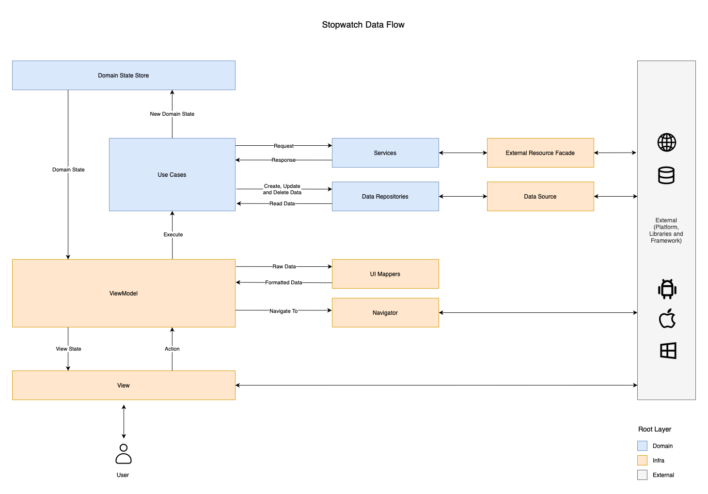
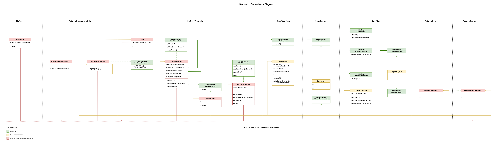

# Architecture

Table of contents
1. [Overview](#1-overview)

2. [Data Flow](#2-data-flow)
    - [2.1. User Interaction and View](#21-user-interaction-and-view)
    - [2.2. ViewModel and Action Handling](#22-viewmodel-and-action-handling)
    - [2.3. Navigation with Navigator](#23-navigation-with-the-navigator)
    - [2.4. Business Logic and Use Cases](#24-business-logic-and-use-cases)
    - [2.5. Domain State Store: The Single Source of Truth](#25-domain-state-store-the-single-source-of-truth)
    - [2.6. View State Updates and UI Mappers](#26-view-state-updates-and-ui-mappers)
3. [Dependency Diagram](#3-dependency-diagram)
4. [Code Structure](#4-code-structure)
    - 4.1. domain/
      - 4.1.1. data/
        - 4.1.1.1. data_sources/
        - 4.1.1.2. repositories/
        - 4.1.1.3. stores/
      - 4.1.2. entities/
      - 4.1.3. services/
        - 4.1.3.1. external_resources/
      - 4.1.4. use_cases/
      - 4.1.5. utils/
    - 4.2. infra/
      - 4.2.1. data/
        - 4.2.1.1. persistency_library/
          - 4.2.1.1.1. data_sources/
          - 4.2.1.1.2. entities/
      - 4.2.2. di/
      - 4.2.3. presentation/
        - 4.2.3.1. entities/
        - 4.2.3.2. mappers/
        - 4.2.3.3. navigation/
        - 4.2.3.4. view_models/
        - 4.2.3.5. ui_library/
          - 4.2.3.5.1. components/
          - 4.2.3.5.2. navigation/
          - 4.2.3.5.3. views/
      - 4.2.4. services/
          - 4.2.4.1. external_resources/
5. [Tests](#6-tests)
6. [Implementation Details](#5-implementation-details)
7. [References](#7-references)
    - [7.1. Unified Modeling Language (UML)](#71-unified-modeling-language-uml)
    - [7.2. Hexagonal Architecture](#72-hexagonal-architecture)
    - [7.3. Clean Architecture](#73-clean-architecture)
    - [7.4. Unidirectional Data Flow (UDF)](#74-unidirectional-data-flow-udf)
    - [7.5. Dependency Inversion Principle (DIP)](#75-dependency-inversion-principle-dip)
    - [7.6. Design Patterns](#76-design-patterns)
      - [7.6.1. Abstract Factory](#761-abstract-factory)
      - [7.6.2. Facade](#762-facade)
      - [7.6.3. Observer](#763-observer)
      - [7.6.4. Command](#764-command)

## 1. Overview
Despite its seemingly straightforward functionality, a stopwatch application presents a significant challenge in managing a high volume of events within short timeframes. The proposed implementation updates the stopwatch state every 10 milliseconds during operation, while concurrently handling user interactions. To address this demanding event processing requirement, the application leverages a [Unidirectional Data Flow (UDF)](#74-unidirectional-data-flow-udf) architecture.

## 2. Data Flow
The application's data flow usually begins with user interactions on the Graphical User Interface (GUI). These interactions trigger a series of processing steps, which result in data visualizations being presented back to the user through the GUI. This cyclical process is illustrated in the following diagram and described in detail by the subsequent sections:

### 2.1. User Interaction and View
The user interface (UI) is presented through Views, which are responsible for displaying information and handling user interactions. When a user interacts with a View (e.g., clicking a button), it emits an Action event. This event encapsulates relevant information about the interaction, such as Action.Start when the Start button is clicked.

### 2.2. ViewModel and Action Handling
The ViewModel acts as an intermediary between the View and the application logic. It receives Action events from the View and processes them accordingly. The ViewModel is responsible for:
- Executing relevant Use Cases based on the received Action.
- Instructing the Navigator to transition between different Views.
- Updating the View State to reflect changes in the application's data.

### 2.3. Navigation with the Navigator
The Navigator handles all screen navigation within the application. It interacts directly with the UI framework and libraries to manage View transitions and rendering. The ViewModel directs the Navigator to navigate to specific Views based on user actions or application logic.

### 2.4. Business Logic and Use Cases
Use Cases encapsulate the core business logic of the application. They may delegate tasks to Services for performing specilized operations or accessing external resources though the [Facade Pattern](#762-facade). Use Cases utilize Data Repositories to persist data beyond the application's lifecycle. During execution, Use Cases may update the application's state by emitting a new Domain State to the Domain State Store using the [Command Pattern](#764-command).

### 2.5. Domain State Store: The Single Source of Truth
The Domain State Store serves as the central repository for the application's state. Components interested in state changes can subscribe to updates using the [Observer Pattern](#763-observer). This ensures that all parts of the application have a consistent view of the current state.

### 2.6. View State Updates and UI Mappers
The ViewModel subscribes to Domain State changes and updates the View State accordingly. To transform Domain State into a format suitable for display, the ViewModel utilizes UI Mappers. These mappers handle data transformations and ensure the View State is optimized for UI rendering. The View, also subscribing to View State changes, receives updates via the [Observer Pattern](#763-observer) and refreshes its display.

## 3. Dependency Diagram
To minimize coupling between system components, all dependencies are mediated through interfaces. Furthermore, dependencies flow inward, originating from input/output components (e.g., GUI, data sources) and directed towards core domain logic and entities. When the flow of control goes against the expected dependency direction, the Dependency Inversion Principle (DIP) is employed. The relationships between application components are visualized in the following UML diagram:

## 4. Code Structure

## 5. Tests

## 6. Implementation Details

During architecture implementation, some exceptions were found:

- On Android, *ViewModel* depends on platform specific code, because the
  `androidx.lifecycle.ViewModel` base class must be extended. Otherwise, coroutines won't be
  lifecycle sensitive, possibly leading to memory leaks or unwanted background process running.
- Instead of using **Command Pattern** to update *MutableStateStore*, lambdas were used.
  Thanks to closure, all command parameters can be implied from the lambda creation context.

## 7. References

### 7.1. Unified Modeling Language (UML)

### 7.2. Hexagonal Architecture 

### 7.3. Clean Architecture

### 7.4. Unidirectional Data Flow (UDF)

### 7.5. Dependency Inversion Principle (DIP)

### 7.6. Design Patterns 

#### 7.6.1. Abstract Factory

#### 7.6.2. Facade

#### 7.6.3. Observer

#### 7.6.4. Command
