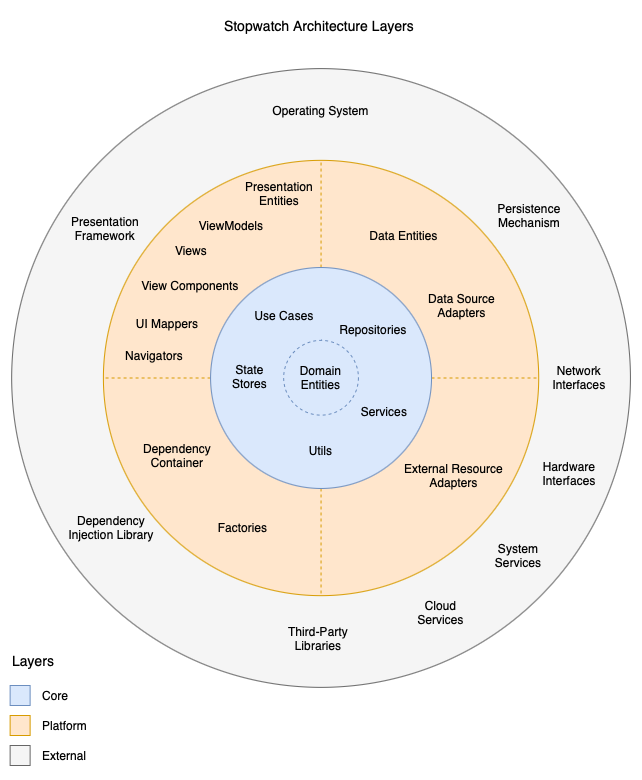
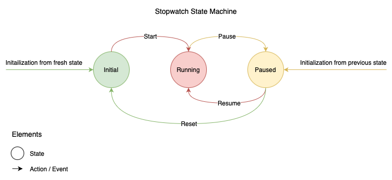

# Architecture

Table of Contents

1.  [Introduction](#1-introduction)
    *   [1.1. Overview](#11-overview)
    *   [1.2. Architectural Goals](#12-architectural-goals)
    *   [1.3. Architectural Approach](#13-architectural-approach)
        *   [1.3.1. Ports and Adapters](#131-ports-and-adapters)
        *   [1.3.2. Unidirectional Data Flow (UDF)](#132-unidirectional-data-flow-udf)
2.  [Essencial Concepts](#2-essential-concepts)
3.  [Layers](#3-layers)
    *   [3.1. Core](#31-core)
        *   [3.1.1. Core Entities](#311-core-entities)
        *   [3.1.2. Use Cases](#312-use-cases)
        *   [3.1.3. Services](#313-services)
        *   [3.1.4. Data](#314-data)
            *   [3.1.4.1. Repositories](#3141-repositories)
            *   [3.1.4.2. State Stores](#3142-state-stores)
        *   [3.1.5. Utilities](#315-utilities)
    *   [3.2. Platform](#32-platform)
        *   [3.2.1. Presentation](#321-presentation)
            *   [3.2.1.1. Presentation Entities](#3211-presentation-entities)
            *   [3.2.1.2. Views and View Components](#3212-views-and-view-components)
            *   [3.2.1.3. ViewModels](#3213-viewmodels)
            *   [3.2.1.4. UI Mappers](#2214-ui-mappers)
            *   [3.2.1.5. Navigators](#3215-navigators)
        *   [3.2.2. Data](#322-data)
            *   [3.2.2.1. Data Entities](#3221-data-entities)
            *   [3.2.2.2. Data Sources Adapters](#3222-data-sources-adapters)
        *   [3.2.3. Services](#323-services)
            *   [3.2.3.1. External Resource Adapters](#3231-external-resource-adapters)
        *   [3.2.4. Dependency Injection (DI)](#324-dependency-injection-di)
            *   [3.2.4.1. Dependency Container](#3241-dependency-container)
            *   [3.2.4.2. Factories](#3242-factories)
        *   [3.2.5. Application Entry Point](#325-application-entry-point)
    *   [3.3. External](#33-external)
4.  [Stopwatch Specifics](#4-stopwatch-specifics)
    *   [4.1. Time Tracking](#41-time-tracking)
    *   [4.2. Lap Management](#42-lap-management)
    *   [4.3. Stopwatch States](#43-stopwatch-states)
    *   [4.4. UI/UX Considerations](#44-uiux-considerations)
5.  [Data Flow](#5-data-flow)
6.  [State Management](#6-state-management)
    * [6.1. Centralized State Stores](#61-centralized-state-stores)
    * [6.2. Event-Driven State Updates](#62-event-driven-state-updates)
    * [6.3. View State and UI Synchronization](#63-view-state-and-ui-synchronization)

7.  [Dependency Diagram](#7-dependency-diagram)
8.  [Folder Structure](#8-folder-structure)
9.  [Error Handling](#9-error-handling)
10. [Testing Strategy](#10-testing-strategy)
11. [Considerations](#11-considerations)
    * [11.1. Technology Choices](#111-technology-choices)
    * [11.2. Implementation Deviations](#112-implementation-deviations)

## 1. Introduction
### 1.1 Overview
This document presents the architectural design of the Stopwatch, a mobile application for precisely tracking elapsed time and lap intervals. The architecture is based on the Ports and Adapters architectural pattern and is designed to support the app's core functionality: starting, pausing, resuming, resetting, and lap management, while ensuring long-term maintainability and the ability to adapt to evolving user needs.

### 1.2. Architectural Goals 
The primary architectural goals are:

*   **Efficient Data Processing:** Enable the application to efficiently process high-volume data streams.
*   **Separation of Concerns:** Isolate core business logic from implementation details.
*   **Maintainability:** Provide a system that is easy to maintain and modify over time.
*   **Scalability:** Provide a system that can adapt to evolving user needs.
*   **Testability:** Provide a system that is easy to test.

### 1.3. Architectural approach
The [Architectural Goals](#12-architectural-goals) are achieved through a [Unidirectional Data Flow (UDF) approach](#132-unidirectional-data-flow-udf) based on the [Ports and Adapters pattern](#131-ports-and-adapters).

#### 1.3.1 Ports and Adapters
To achieve a high degree of flexibility and testability, the Stopwatch application utilizes the Ports and Adapters (aka Hexagonal Architecture) pattern. This approach separates the core business logic from [external concerns](#33-external), such as the user interface, data storage, and external APIs.

The [Core Layer](#31-core) defines **Ports**, which are interfaces that define how the core interacts with external resources. The [Platform Layer](#32-platform) contains **Adapters**, which provide concrete implementations of these ports, handling the specific details of interacting with external resources. This separation of concerns allows for flexibility in the choice of external resources (such as databases, file systems, or network services) without requiring changes to the core business logic. To replace an external resource, one only needs to implement a new adapter that conforms to the existing port.

The application is designed to be testable, maintainable, and scalable. The use of Ports and Adapters Architecture allows us to test the core business logic in isolation, without needing to set up complex external dependencies. The platform-agnostic core allows us to reuse the same logic across all supported platforms, reducing development time and ensuring consistency.

The following diagram illustrates the Ports and Adapters architectural pattern in the context of the Stopwatch application.


#### 1.3.2 Unidirectional Data Flow (UDF)
The Unidirectional Data Flow (UDF) pattern dictates that data flows in a single direction, determined by its type. **Events**, representing user interactions, flow from the presentation layer towards the core, updating the application's central state—the single source of truth. Conversely, the application's **State** flows from the core towards the user interface. Events trigger central state updates, which then propagate to the user interface.

UDF offers these key benefits:
* **Predictable Data Flow**: The single, defined direction of data flow (events towards state, state towards UI) makes it much easier to trace how data moves through the application. You know exactly where to look for the source of a change and how it propagates.
* **Centralized State**: With a single source of truth for the application's state, you don't have to hunt through multiple components to figure out what the current state is. Everything is in one place.
* **Consistent UI:** Deriving the UI from a single source of truth guarantees consistency and eliminates state duplication.
* **Easier to reason about**: Because of the predictable flow of data, it is easier to reason about the application behavior.
* **Simplified Debugging**: When something goes wrong, the predictable data flow and centralized state make it much easier to pinpoint the source of the problem. You can follow the data flow backward or forward to understand what happened.


The following diagram illustrates the UDF pattern in the context of the Stopwatch application.


## 2. Essential Concepts
This section introduces essential concepts for understanding the application's architecture. Each concept is summarized briefly below. For detailed explanations and further learning, please consult the linked external resources.

* **Ports and Adapters (Hexagonal Architecture)**: This pattern isolates core business logic from external concerns. It defines "Ports" (interfaces) for interaction and "Adapters" (implementations) to connect with external systems. This allows swapping external systems without core modifications. [Read more](https://alistair.cockburn.us/hexagonal-architecture/).

* **Unidirectional Data Flow (UDF)**: UDF ensures data flows in a single direction, enhancing predictability. Typically, user interactions trigger events, which update the state, and then the UI reflects these changes. This is ideal for applications with high stream demand. [Read more](https://developer.android.com/develop/ui/compose/architecture#udf).

* **Dependency Injection (DI)**: DI provides objects with their dependencies from external sources, rather than having them create them internally. This promotes loose coupling, improving modularity and testability. It makes code more maintainable. [Read more](https://builtin.com/articles/dependency-injection).

* **Dependency Inversion Principle (DIP)**: DIP dictates that high-level modules should depend on abstractions, not concrete implementations. This inverts the traditional dependency direction, increasing decoupling and flexibility. It makes code more robust. [Read more](https://www.geeksforgeeks.org/dependecy-inversion-principle-solid/).

* **Design Patterns**: These are reusable solutions to common software design problems. They offer proven templates for solving recurring design challenges. They improve code quality. [Read more](https://refactoring.guru/design-patterns).
  
  * **Abstract Factory**: This pattern provides an interface for creating families of related objects without specifying their concrete classes. It's useful when managing groups of interdependent objects. It improves code organization. [Read more](https://refactoring.guru/design-patterns/abstract-factory).
  
  * **Observer**: This pattern establishes a one-to-many dependency between objects. When a subject changes, its observers are automatically notified, enabling event handling and state change notifications. It improves code decoupling. [Read more](https://refactoring.guru/design-patterns/observer).
  
  * **Command**: This pattern encapsulates a request as an object, enabling parameterization, queuing, and undoable operations. It decouples the invoker from the object that performs the operation. It improves code flexibility. [Read more](https://refactoring.guru/design-patterns/command).
  
  * **Adapter**: This pattern allows incompatible interfaces to work together by providing a wrapper. It converts one interface into another that clients expect. It improves code reusability. [Read more](https://refactoring.guru/design-patterns/adapter).

## 3. Layers
The application's architecture is structured into three distinct layers: [Core](#31-core), [Platform](#31-core), and [External](#33-external). This layered approach promotes a clear separation of concerns, enhances testability and maintainability, and allows for code reuse across different platforms.

*   **Core Layer:** Contains the platform-independent business logic, core entities, and use cases. It defines *what* the application does, independent of any specific platform.
*   **Platform Layer:** Contains the platform-specific code required to implement the application on a particular platform (e.g., Android or iOS). It handles the user interface, user interactions, and platform-specific APIs.
*   **External Layer:** Represents third-party libraries, frameworks, services, the underlying operating system, and platform services that the application interacts with but does not directly control. It is accessed through the Platform layer. This layer is conceptual and does not contain application code.

The [Core](#31-core) layer is independent of both the [Platform](#32-platform) and [External](#33-external) layers. The [Platform](#32-platform) layer depends on the [Core](#31-core) layer and adapts it to the specific platform. The [Platform](#32-platform) layer also accesses the [External](#33-external) layer and adapts it to the [Core](#31-core) layer. This dependency structure, as illustrated in the diagram below, isolates the Core layer from changes in the Platform and External layers, promoting stability and maintainability.



### 3.1. Core
The Core layer contains the application's platform-independent business logic, core entities, and use cases. This layer is entirely free of platform-specific code and can be reused across different platforms (e.g., Android, iOS). It defines *what* the application does, independent of *how* it is presented or implemented on a specific platform.

*   **Responsibilities:**
    *   Defining the application's core business rules and logic.
    *   Managing core entities and data structures.
    *   Implementing Use Cases that represent the application's core functionality.
    *   Providing interfaces for data access through Repositories.
    *   Defining the application's core state.
*   **Key Components:**
    *   [Core Entities](#311-core-entities)
    *   [Use Cases](#312-use-cases)
    *   [Services](#313-services)
    *   [Repositories](#3141-repositories)
    *   [State Stores](#3142-state-stores)
    *   [Utilities](#315-utilities)


#### 3.1.1. Core Entities
Core Entities represent the core data structures and types within the application. These data structures are primarily data containers, encapsulating the essential information without inherent behavior. They are utilized throughout the [Core layer](#31-core) and may also be accessed by the [Platform layer](#32-platform) for platform-specific adaptations.

In the context of the stopwatch application, a Core Entity representing the application state could be defined as follows:

```
enum StopwatchStatus:
  STOPPED
  RUNNING

class StopwatchState:
  status: StopwatchStatus
  time: Integer // milliseconds
```

#### 3.1.2. Use Cases
Use Cases encapsulate the core business logic of the application. They orchestrate operations by delegating tasks to [Services](#313-services) and accessing data through [State Stores](#3142-state-stores) and [Repositories](#3141-repositories). Each Use Case focuses on a specific business operation, promoting modularity and maintainability. Even a simple application may comprise numerous, specialized Use Cases to address various functionalities.

The following code snippet demonstrates a potential implementation of a Use Case for starting a stopwatch:

```
import StopwatchState from core/entities
import StopwatchStateStore from core/data/state_stores/StopwatchStateStore
import TimerService from core/services/TimerService

class StartStopwatchUseCase:
  stateStore: StopwatchStateStore
  timerService: TimerService

  execute():
    if stateStore.state.status == StopwatchStatus.STOPPED:
      timerService.start() 
      newState = StopwatchState(status = StopwatchState.RUNNING, time = 0)
      stateStore.update(newState)
```

#### 3.1.3. Services
Services encapsulate specialized business operations, often involving complex algorithms or interactions with external resources. [Use Cases](#312-use-cases) leverage Services to delegate specific tasks or access specialized functionalities.

The following code snippet illustrates a potential implementation of a timer Service that notifies listeners about state updates:

```
class TimerState:
  isRunning: Boolean
  time: Integer

interface TimerListener:
  handleUpdate(timerState: TimerState)

class TimerService:
  state: TimerState
  listeners: TimerListener[]

  start():
    if !state.isRunning:
      newState = TimerState(isRunning = true, time = 0)
      updateState(newState)
      loop()

  loop():
    while state.isRunning:
      delay(milliseconds = 10)
      newTime = state.time + 10
      newState = TimerState(isRunning = state.isRunning, time = newTime)
      updateState(newState)

  updateState(newState: TimerState):
    state = newState
    for listener in listeners:
      listener.handleUpdate(newState)

  stop():
  ...

  addListener(listener: TimerListener):
  ...

  removeListener(listener: TimerListener):
  ...
```

#### 3.1.4. Data
The Core Data layer comprises components that [Use Cases](#312-use-cases) utilize for updating application state or accessing external data sources. These components provide an abstraction layer, allowing Use Cases to interact with data without being tightly coupled to specific implementation details.

#### 3.1.4.1. Repositories
Repositories abstract data access for [Use Cases](#312-use-cases), enabling local data persistence and potential integration with external [Data Sources](#3222-data-sources). They provide a well-defined interface, allowing Use Cases to interact with data without depending on specific implementation details. This abstraction promotes flexibility and maintainability by decoupling the business logic from the underlying data storage mechanisms.

The following code snippet demonstrates a potential implementation of a Repository for a stopwatch application that synchronize state between muliple devices. This implementation retrieves stopwatch state from two sources: a remote server and a local cache. If the remote server fails to provide the latest stopwatch state (e.g., due to network connectivity issues), the repository falls back to the local cache. This strategy ensures data availability even in offline scenarios, enhancing the application's resilience.

```
import StopwatchState from core/entities/StopwatchState
import LocalStopwatchStateDataSourcePort from core/data/data_sources/LocalStopwatchStateDataSource 
import RemoteStopwatchStateDataSourcePort from core/data/data_sources/RemoteStopwatchStateDataSourcePort 

class StopwatchStateRepository:
  cache: LocalStopwatchStateDataSourcePort
  server: RemoteStopwatchStateDataSourcePort

  load() -> StopwatchState?:
    try:
      state = server.load()
      cache.save(state)
    catch:
      // do nothing

    return cache.load()
```

#### 3.1.4.2. State Stores
State Stores serve as the single source of truth for application state, providing a centralized and consistent representation of data. Use Cases interact with State Stores to update and retrieve the application's state. To notify interested components about state changes, State Stores employ a publish-subscribe mechanism, often implemented using an Observer pattern-like approach. This allows components to react to state updates in a decoupled and efficient manner.

The following code snippet demonstrates an implementation of a StopwatchState State Store using the Observer pattern:

```
import StopwatchState from core/entities/StopwatchState 

class StopwatchStateListener:
  handleUpdate(newState: StopwatchState)

class StopwatchStateStore:
  state: StopwatchState 
  listeners: StopwatchStateListener[]

  updateState(newState: StopwatchState)
    state = newState 
    for listener in listeners:
      listener.handleUpdate(state)

  addListener(listener: StopwatchStateListener):
    if listener not in listeners:
      listeners.add(listener)
  
  removeListener(listener: StopwatchStateListener):
    if listener in listernes:
      listeners.remove(listener)
```

#### 3.1.5. Utilities
Utility classes and functions, often referred to as "Utils," provide reusable helper functionalities that can be accessed by various components across the application. These utilities typically encapsulate common operations or logic that are not specific to any particular core or layer.

The following code snippet illustrates the types of functionalities that might be included within utility classes:

```
class DateUtilities
  static diff(date1: Date, date2: Date) -> Date:
    diff = date1.toMilliseconds() - date2.toMilliseconds()
    return Date(milliseconds = Math.abs(diff))
  
// Usage
championshipMatch = Date(...) // some arbitrary date
today = Date()
remainingDate = DateUtilities.diff(today, championshipMatch)
print("Remaining days: ", remainingDate.days)
```

### 3.2. Platform
The Platform layer contains the platform-specific code required to implement the application on a particular platform (e.g., Android or iOS). This layer is responsible for presenting the application's data to the user, handling user interactions, and interacting with platform-specific APIs. It depends on the [Core layer](#31-core) and adapts it to the specific platform. It also accesses the [External layer](#33-external) and adapts it to the [Core layer](#core).

*   **Responsibilities:**
    *   Implementing the user interface (UI) using platform-specific UI frameworks (e.g., Jetpack Compose on Android, SwiftUI on iOS).
    *   Managing the application's presentation logic (Views, ViewModels).
    *   Handling user interactions and events.
    *   Interacting with platform-specific APIs (e.g., location services, camera, push notifications).
    *   Adapting the Core layer's data and logic for the specific platform.
    *   Accessing the External layer and adapting it to the Core layer.
*   **Key Components:**
    *   [Presentation](#321-presentation) ([Presentation Entities](#3211-presentation-entities), [Views](#3212-views-and-view-components), [ViewModels](#3213-viewmodels), [UI Mappers](#2214-ui-mappers), [Navigators](#3215-navigators))
    *   [Data](#322-data) ([Data Entities](#3221-data-entities), [Data Sources](#3222-data-sources))
    *   [Services](#323-services) ([External Resource Adapters](#3231-external-resource-adapters))
    *   [Dependency Injection](#324-dependency-injection-di) ([Dependency Container](#3241-dependency-container) and [Factories](#3242-factories))
    *   [Application Entry Point](#325-application-entry-point)

#### 3.2.1. Presentation
The Presentation layer exhibits platform-specific variations in its implementation. In some applications, it encompasses graphical user interface (GUI) elements, while in others, it may involve simple text-based input/output through a command-line interface (CLI). It could even be realized as a network protocol like HTTP. In the context of this stopwatch mobile application, the Presentation layer utilizes platform-specific GUI libraries for rendering data, handling user interactions, and managing navigation within the application. It encapsulates all the logic necessary for presentation, ensuring a clear separation of concerns from the underlying business logic and data access layers.

#### 3.2.1.1. Presentation Entities
Presentation Entities represent data structures and types that are shared and utilized by various components within the Presentation layer. These entities primarily serve as data containers, encapsulating information relevant to the presentation logic without inherent behavior. They promote consistency and maintainability by providing a unified representation of data across different parts of the user interface. Furthermore, Presentation Entities are tailored to represent data in a format that is most convenient for the View, facilitating efficient rendering and data binding.

The following code snippet illustrates an example of a Presentation Entity representing the stopwatch time:

```
class StopwatchViewTime:
  minutes: String[]
  seconds: String[]
  fraction: String[]
```

#### 3.2.1.2. Views and View Components
**Views** are responsible for rendering the graphical user interface (GUI) and handling user interactions. They act as the visual representation of the application's state. Views can be composed of smaller, reusable UI elements called **View Components**, which encapsulate specific UI functionality. Views observe changes in the [ViewModel's](#3213-viewmodels) state through an Observer-like pattern and update their display accordingly, ensuring that the UI remains synchronized with the underlying data. Furthermore, when users interact with the UI, Views forward the appropriate Action to the ViewModel for processing.

The following code snippet demonstrates a basic stopwatch View that uses a stylized button View Component:

```
import StopwatchAction, StopwatchViewModel, StopwatchViewStateListener
  from platform/presentation/viewmodels/StopwatchViewModel

import PrimaryButton from platform/presentation/view_components/PrimaryButton

class StopwatchView implements StopwatchViewStateListener:
  context: UiLibraryContext
  viewModel: CounterViewModel

  init():
    viewModel.addListener(this)
    context.onBackButton(handleBack)

  render(state: CounterViewState):
    text = Text(value = state.count)
    
    switch state.status:
      case StopwatchStatus.STOPPED:
        button = PrimaryButton(text = "Start", onClick = handleStart)
      case StopwatchStatus.RUNNING:
        button = PrimaryButton(text = "Stop", onClick = handleStop)

    container = Column(alignment = "center", spacing = "10px")
    container.append(element = text)
    container.append(element = button)

    context.updateUi(element = container)

  private handleStart():
    viewModel.handleAction(StopwatchAction.START)

  private handleStop():
    viewModel.handleAction(StopwatchAction.STOP)

  private handleBack():
    viewModel.handleAction(StopwatchAction.BACK)

  handleUpdate(state: CounterViewState):
    render(state)


// View Component (platform/presentation/view_components/PrimaryButton)
class PrimaryButton:
  text: String
  onClick: () -> Void

  render():
    Button(
      text = text,
      onClick = onClick,
      color = Colors.primary,
      padding = "10px",
      border = "rounded"
    )
```

#### 3.2.1.3. ViewModels
ViewModels act as the intermediaries between the [View](#3212-views-and-view-components) and the application's [Core layer](#31-core). Their primary responsibilities are to manage the View's state and to handle user interactions. ViewModels are responsible for ensuring the View always displays the correct and up-to-date information.

ViewModels handle user interactions by receiving Actions. These Actions are simple data structures (typically Sealed Objects in Kotlin or Enums in Swift) that describe user interactions or events within the View. Upon receiving an Action, ViewModels process it. This processing may involve delegating work to one or more [Use Cases](#312-use-cases) to perform business logic operations, or instructing a [Navigator](#3215-navigators) to transition to a different View or location within the application.

ViewModels also subscribe to the Core [State Store](#3142-state-stores), which holds the application's overall state, using an Observer-like pattern. When the Core State changes, ViewModels receive these updates. Based on the nature of the state change, ViewModels may instruct the Navigator to transition to a different View or location. They may also transform the received data, typically by delegating this transformation to a [UI Mapper](#2214-ui-mappers). Finally, ViewModels update the View State—a simple data structure that holds the information needed to render the View in a format suitable for the View to consume—ensuring the View always displays the correct and up-to-date information.

The following code snippet demonstrates a simple stopwatch ViewModel:

```
import StopwatchState, StopwatchStatus from core/entities/StopwatchState
import StopwatchStateListener from core/data/state_stores/StopwatchStateStore

class StopwatchViewState:
  status: StopwatchStatus
  time: String

enum StopwatchAction:
  START
  STOP
  BACK

interface StopwatchViewStateListener:
  handleUpdate(stopwatchViewState: StopwatchViewState)

class StopwatchViewModel implements StopwatchStateListener:
  state: StopwatchViewState
  listeners: StopwatchViewStateListener[]
  stateStore: StopwatchStateStore

  startStopwatch: StartStopwatchUseCase
  stopStopwatch: StopStopwatchUseCase
  timeUiMapper: StopwatchTimeUiMapper
  navigator: Navigator

  init():
    stateStore.addListener(this)

  handleAction(action: StopwatchAction):
    switch action:
      case StopwatchAction.START: startStopwatch.execute()
      case StopwatchAction.STOP: stopStopwatch.execute()
      case StopwatchAction.BACK: navigator.back() 

  handleUpdate(newState: StopwatchState):
    state = StopwatchViewState(
      status = newState.status,
      time = timeUiMapper.map(newState.time)
    )

    for listener in listeners:
      listener.update(state)

  addListener(listener: StopwatchViewStateListener)
  ...

  removeListener(listener: StopwatchViewStateListener)
  ...
```

#### 2.2.1.4. UI Mappers
UI Mappers transform data into a format suitable for presentation, easing the [ViewModel's](#3213-viewmodels) formatting burden.

The following code demonstrates a stopwatch time UI Mapper:

```
class StopwatchTimeUiMapper:
  map(milliseconds: Integer) -> String:
    fraction = milliseconds / 10 % 100
    seconds = milliseconds / 1000 % 60
    minutes = milliseconds / 60000

    return format("%02d:02d.%02d", minutes, seconds, fraction)
```

#### 3.2.1.5. Navigators
Navigators handle screen transitions, relieving [ViewModels](#3213-viewmodels) of navigation logic. They typically wrap underlying UI library navigation code, adding convenience and abstracting implementation details.

The following code demonstrates a basic Navigator:

```
class Navigator:
  uiLibraryNavigator: UILibraryNavigator
  locationStack: String[]

  navigate(location: String):
    if location not in locationStack:
      locationStack.push(location)
      uiLibraryNavigator.navigate(location)

  back():
  ...
```

#### 3.2.2. Data
The [Platform layer](#32-platform) implements [Data Sources Adapters](#3222-data-sources) defined in the [Core layer](#31-core), connecting to external data resources and hiding platform-specific details. This promotes loose coupling and isolates the Core layer from data access implementation specifics.

#### 3.2.2.1. Data Entities
Platform Data Entities represent data structures used by third-party libraries for Data Source implementation, reflecting the library's data format and serialization.

The following code demonstrates an Platform Data Entity. Note the introduction of third-party library specific code:

```
import Table, Column from database_library

class StopwatchStateEntity: Table(name = "stopwatch_state"):
  id: Column(name = "id", type = "INTEGER", primary = true) 

  status: Column(name = "status", type = "INTEGER", nullable = false)

  time: Column(name = "time", type = "INTEGER", nullable = false)
```

#### 3.2.2.2. Data Sources Adapters
Data Source Adapters are responsible for interacting with external data persistence mechanisms, such as databases, files, or network services. They act as the bridge between the [Core layer](#31-core) and the [External layer](#33-external). Following the Ports and Adapters pattern, the Core layer defines Data Source Ports (interfaces) that specify how data should be accessed. The Platform layer then provides concrete implementations of these ports in the form of Data Source Adapters. These adapters encapsulate the specific details of interacting with each persistence mechanism, allowing [Repositories](#3141-repositories) to access data without needing to know the underlying implementation. This design enables the use of different Data Source Adapters interchangeably, providing flexibility and testability.

The following code demonstrates a Data Source implementation for saving and restoring stopwatch state: 

```
import Connection from database_library
import StopwatchStateDataSourcePort from core/data/data_sources/StopwatchDataSourcePort

class DatabaseStopwatchStateDataSourceAdapter implements StopwatchStateDataSourcePort:
  connection: Connection

  save(state: StopwatchState):
    entity = StopwatchStateEntity(
      id = 1,
      status = state.status.toInt(),
      time = state.time
    )
    
    connection.save(entity)
    
  load() -> StopwatchState?:
    entity = connection.findById(id = 1, entity = StopwatchStateEntity)
    if entity == null:
      return null 

    return StopwatchState(
      status = Status.fromInt(entity.status),
      time = entity.time
    )
```

#### 3.2.3. Services
The Platform Services layer provides concrete implementations for External Resource Ports defined in the [Core Services layer](#313-services).

#### 3.2.3.1. External Resource Adapters
External Resource Adapters are responsible for handling interactions with external resources, including third-party libraries and operating system functionalities. They act as the bridge between the [Core layer](#31-core) and the [External layer](#33-external). The Core layer defines External Resource Ports (interfaces) that specify how these external resources should be accessed, and the Platform layer provides concrete implementations of these ports in the form of External Resource Adapters. These adapters encapsulate the specific details of interacting with each external resource, allowing Core [Services](#313-services) to remain agnostic of the underlying implementation. This design decouples Core Services from external dependencies, providing flexibility and testability.

The following code demonstrates an External Resource Adapter of a email service:

```
import EmailProviderPort from core/services/external_resource_ports/EmailProviderPort
import MailService, Credentials from third_party_email_library

class EmailProviderAdapter implements EmailProviderPort:
  mail: MailService

  init(credentials: Credentials):
    mail = MailService(credentials)

  send(message: EmailMessage):
    mail.send(
      from = credentations.accountEmail, 
      to = message.to,
      subject = message.subject,
      body = message.body
    )
```

#### 3.2.4. Dependency Injection (DI)
The Dependency Injection (DI) layer manages resource initialization and object creation, primarily using Abstract Factories to decouple client code from concrete implementations.

#### 3.2.4.1. Dependency Container
The Dependency Container stores and provides dependencies required for object creation.

The following code illustrates an potential Dependency Container for a stopwatch application: 

```
class DataContainer:
  stopwatchRepository: StopwatchDataRepository
  stateStore: StateStore<StopwatchState>

class ServicesContainer:
  timer: TimerService

class UseCasesContainer:
  startStopwatch: StartStopwatchUseCase
  stopStopwatch: StopStopwatchUseCase

class PresentationContainer:
  navigator: Navigator
  timeUiMapper: TimeUiMapper

class StopwatchDependencyContainer:
  data: DataContainer
  services: ServicesContainer
  useCases: UseCasesContainer
  presentation: PresentationContainer

  init():
    data = DataContainer(
      stopwatchRepository = StopwatchDataRepositoryImpl(),
      stateStore = StateStoreImpl(StopwatchState())
    )

    services = ServicesContainer(
      timer = TimerServiceImpl()
    )

    useCases = UseCasesContainer(
      startStopwatch = StartStopwatchUseCaseImpl(data.stateStore, services.timer),
      stopStopwatch = StopStopwatchUseCaseImpl(data.stateStore, services.timer),
    )

    presentation = PresentationContainer(
      navigator = Navigator(),
      timeUiMapper = TimeUiMapper()
    )
```

#### 3.2.4.2. Factories
Factories decouple object creation from usage, typically implementing the Abstract Factory pattern and leveraging dependency injection. They are passed as arguments to consuming classes and functions.

The following code demonstrates a ViewModel Factory implementation:

```
class ViewModelFactory:
  container: StopwatchDependencyContainer

  make():
    return ViewModel(
      stateStore = container.data.stateStore,
      startStopwatch = container.useCases.startStopwatch,
      stopStopwatch = container.useCases.stopStopwatch,
      timeUiMapper = container.presentation.timeUiMapper,
      navigator = container.presentation.navigator
    )

// Client code
class View:
  viewModel: ViewModel

  init(viewModelFactory: ViewModelFactory):
    viewModel = viewModelFactory.make()

  render():
  ...
```

#### 3.2.5. Application Entry Point
Application Entry Points differ significantly across platforms, ranging from a simple `main` function to complex class hierarchies. In Android, the entry point is the class specified in the `AndroidManifest.xml` file, while in iOS, it's a struct with the `@main` annotation. The Application Entry Point is responsible for creating the [Dependency Container](#3241-dependency-container) and performing all necessary initializations.

### 3.3. External
The [External](#33-external) layer represents components that the application interacts with but does not directly control. This layer is isolated from the Core layer and is accessed through the Platform layer. This layer is conceptual and does not contain application code. As shown in the diagram, the External layer includes the following key components:

**Key Components:**
  *   **Operating System (OS):** Provides fundamental services and resources, such as process management, memory allocation, and file system access.
  *   **Presentation Framework:** Handles the user interface and interaction, including UI elements, layout management, and event handling (e.g., Jetpack Compose, SwiftUI).
  *   **Persistence Mechanism:** Manages data storage and retrieval, encompassing databases (e.g., Room, SQLite, Core Data), file systems, and other storage solutions.
  *   **Network Interfaces:** Facilitates communication with external systems and services, enabling data transfer and interaction with remote resources (e.g., Retrofit, OkHttp, URLSession).
  *   **Dependency Injection (DI) Library:** Manages object creation and dependency resolution, promoting loose coupling and modularity (e.g., Hilt, Koin).
  *   **Third-Party Libraries:** Provides specialized functionalities, such as image loading, analytics, or payment processing, that are not part of the core application or platform (e.g., Glide, SDWebImage, Firebase).
  *   **Hardware Interfaces:** Provides access to device hardware components, such as the camera, GPS, sensors, and Bluetooth.
  *   **Cloud Services:** Integrates with cloud-based platforms for services like data storage, authentication, and push notifications (e.g., AWS, Google Cloud, Azure).
  *   **System Services:** Provides access to platform-specific services, such as location services, notification management, and background tasks.
  *   **Security Frameworks:** Provides security features such as encryption, authentication, and authorization.

## 4. Stopwatch Specifics
### 4.1. Time Tracking

The Stopwatch tracks time with a high degree of precision, updating the elapsed time every 10 milliseconds (100 times per second). This interval provides sufficient accuracy for most everyday activities and scenarios. Both the internal timer and the Stopwatch User Interface are updated at this same rate. Consequently, there is a frequent flow of data from the Core layer to the Presentation layer, ensuring the UI accurately reflects the elapsed time.

### 4.2. Lap Management

The list of completed laps is a crucial part of the application's core state. Each lap record includes the lap number, its status (e.g., running, completed, best, worst), and the time it took to complete. The current, actively running lap is not stored as a separate entity in the core state. Instead, its duration is dynamically calculated at runtime by subtracting the total accumulated time of all completed laps from the current stopwatch time. This approach ensures that the core state only stores persistent data, while transient data is derived as needed.

### 4.3. Stopwatch States

The Stopwatch can exist in one of three distinct states:

*   **Initial:** Upon a clean initialization (starting from a fresh state, not loading a previous state), the Stopwatch begins in the Initial state. In this state, the elapsed time is zero, and there are no completed laps. Only a clean initialization or a Reset Action can transition the Stopwatch to the Initial state.
*   **Running:** When the Stopwatch is actively tracking time, the application is in the Running state. In this state, the elapsed time is continuously updated. Only a Start Action or a Resume Action can transition the application to the Running state.
*   **Paused:** In the Paused state, the Stopwatch's time tracking is halted, and the elapsed time remains frozen. Only a Pause Action can transition the application to the Paused state.

The following state machine diagram illustrates the Stopwatch's states and the actions that trigger state transitions.



### 4.4. UI/UX Considerations

To provide a focused and intuitive user experience, the application features two primary Views:

*   **Home View:** This View displays the current elapsed time prominently, along with the primary stopwatch control buttons (Start, Pause, Lap, Reset). It also includes a section showing the current lap's time and the two most recently completed laps. This provides a quick overview of the current timing and recent lap history.
*   **Laps View:** This View provides a comprehensive view of all lap data. It displays the current elapsed time, the current lap's time, and a complete list of all completed laps. Additionally, it includes a button that allows the user to start the timer if it is paused or to add a new lap if the stopwatch is running. Navigation to the Laps View is enabled only when at least three laps have been completed, ensuring there is sufficient lap data to display.

## 5. Data Flow 


The application employs a unidirectional data flow as illustrated above. The data flow is as follows:

1.  The user interacts with the Graphical User Interface (GUI) through **Views**. These interactions can include actions like tapping a button, entering text, or swiping.
2.  The **View** captures the user interaction and triggers a corresponding **Action**. This action is then communicated to the associated **ViewModel**.
3.  The **ViewModel** receives the **Action** and processes it. Based on the action, the ViewModel may perform one or both of the following:
    *   a. The ViewModel invokes one or more **Use Cases** to execute the necessary business logic.
    *   b. The ViewModel instructs the **Navigator** to navigate to a different screen or destination within the application.
4.  The **Use Case** executes the required business logic. During this process, it may perform one or both of the following:
    *   a. The Use Case utilizes **Services** to perform specialized operations or to interact with external resources (e.g., network, database, sensors).
    *   b. The Use Case accesses and manipulates data through **Repositories**.
5.  After executing the business logic, the **Use Case** updates the **Core State Store** to reflect any changes to the application's core state.
6.  The **ViewModel** observes the **Core State Store** for changes.
7.  When the **ViewModel** detects a change in the **Core State Store**, it updates its internal state. This may involve one or both of the following:
    *   a. The ViewModel uses **UI Mappers** to transform the core state data into a format suitable for the UI, resulting in an updated **View State**.
    *   b. The ViewModel instructs the **Navigator** to navigate to a different screen or destination.
8.  The **View** observes the **ViewModel's View State** for changes.
9.  When the **View** detects a change in the **View State**, it updates the GUI to reflect the new state. The user sees the updated GUI, reflecting the current state of the application.


## 6. State Management
### 6.1. Centralized State Stores
The Stopwatch application uses a centralized [State Store](#3142-state-stores) as the single source of truth for its core state. This ensures all components interested in the core state remain synchronized via an Observer-like pattern approach. While the State Store is the single source of truth, its state can be updated by other components, but only through a controlled mechanism with a single point of update. This prevents inconsistencies. The primary State Store is the Core State Store, located within the [Core layer](#31-core).

The Stopwatch application does not require additional State Stores, such as a Presentation State Store, because [ViewModels](#3213-viewmodels) do not share any presentation-specific state.

### 6.2. Event-Driven State Updates
The Stopwatch application handles two distinct types of events that can lead to Core State Store updates:

*   **User-Initiated Events:** These events originate in the [Presentation layer](#321-presentation) as a result of user interactions. They may propagate through other layers, ultimately triggering specific [Use Cases](#312-use-cases) that handle the logic for updating the Core State Store. This flow of events generally follows the flow of control (from Presentation to State Store).
*   **Timer-Initiated Events:** The Timer Service, located in the Core layer, triggers Timer State updates. These state changes are mainly triggered when the running time updates. These events also trigger a specific use case that handles the logic for updating the Core State Store.

### 6.3. View State and UI Synchronization
In the Stopwatch application, ViewModels are the primary components interested in changes to the Core State Store. Each ViewModel maintains its own View State, which is specific to the presentation logic of the corresponding View. When a state change occurs in the Core State Store, the ViewModel receives the updated Stopwatch state, transforms it (using [UI Mappers](#2214-ui-mappers)), and uses it to update its View State. Views then observe changes in their corresponding ViewModel's View State and update the UI accordingly.

## 7. Dependency Diagram
To minimize coupling between system components, all dependencies are mediated through interfaces. Furthermore, dependencies flow inward, originating from input/output components (e.g., GUI, data sources) and directed towards core business logic and entities, aligning with principles of [Clean Architecture](#). When the flow of control necessitates a reversal of this dependency direction, the [Dependency Inversion Principle (DIP)](#) is applied. Additionally, to decouple object creation from utilization, the [Abstract Factory](#) pattern is employed. The relationships between application components are visualized in the following [UML](https://www.geeksforgeeks.org/unified-modeling-language-uml-class-diagrams/) diagram:


## 8. Folder Structure
The Android and iOS applications were developed independently, utilizing the recommended languages and frameworks for each platform: [Kotlin with Jetpack Compose](https://developer.android.com/courses/android-basics-compose/course) for Android and [Swift with SwiftUI](https://developer.apple.com/tutorials/app-dev-training/) for iOS. Despite the technological differences, both implementations adhere to a common architecture and folder structure. The Android codebase resides in the `android` folder, while the iOS codebase is located in the `ios` folder.

The following diagram illustrates the application's folder structure:

```
-- src
   |-- core
   |   |-- data
   |   |   |-- data_source_ports
   |   |   |-- repositories
   |   |   \-- stores
   |   |
   |   |-- entities
   |   |
   |   |-- services
   |   |   \-- external_resource_ports
   |   |
   |   |-- use_cases
   |   |
   |   \-- utils
   | 
   \-- platform
       |-- data
       |   \-- [persistency library]
       |       |-- data_source_adapters
       |       \-- entities
       |
       |-- di
       |
       |-- presentation
       |   |-- entities
       |   |-- mappers
       |   |-- navigation (interfaces)
       |   |-- view_models
       |   |
       |   \-- [ui library]
       |       |--- components
       |       |--- navigation (implementations)
       |       \--- views
       |
       \-- services
           \-- external_resource_adapters

-- tests
```

While platform-specific nuances may influence the final implementation details, the overall project structure and organization should remain consistent across platforms.

## 9. Error Handling
The primary source of potential errors in the Stopwatch involves state persistence. Specifically, errors may occur when saving or restoring the application's state if the persistence mechanism (database or file system) is unavailable or if the required data is not present. As these state persistence operations are transparent to the user, no user intervention is necessary. Errors are handled silently, without displaying any user-facing warnings. Comprehensive error logs are recorded on the device to facilitate troubleshooting.

## 10. Testing Strategy
The testing strategy emphasizes thorough unit testing of the core business logic, state management and presentation layer, covering happy paths, error scenarios, and edge cases to ensure application robustness.

**Unit Testing Focus:**
Unit tests validate component behavior. While primarily focused on individual components, tests may sometimes involve a small cluster of related components. Mocking related components within the core layer is generally avoided.

**Tested components:**
* **Core layer:**
  *   **Use Cases:** Validate core business logic and component interactions.
  *   **Services:** Verify internal logic and calculations. Since these services are internal, tests focus on algorithms and state management.
  *   **State Stores:** Validate event-driven behavior and state management.

* **Platform layer:**
  *   **UI Mappers:** Verify correct mapping of core data to presentation data across various scenarios.

**Note:** The components listed above are the current ones with logic and behavior worth testing. As the application grows, other components may also be targeted for testing, and other types of testing (integration, end-to-end) may be implemented. The current testing approach seems to be enough.

## 11. Considerations

### 11.1. Technology Choices
The table below details the specific technology choices made for the Android and iOS implementations:

| Technology Area            | Android              | iOS                        |
| :------------------------- | :------------------- | :------------------------- |
| **Programming Language**   | Kotlin               | Swift                      |
| **Data Stream Management** | Kotlin Coroutines    | Combine + Observer Pattern |
| **UI Framework**           | Jetpack Compose      | SwiftUI                    |
| **Local Data Persistence** | Room (SQLite)        | FileManager                |
| **Unit Testing Framework** | JUnit                | Swift Testing              |

### 11.2. Implementation Deviations
During the implementation phase, certain deviations from the planned architecture were adopted:

*   **Core State Updates:** Instead of employing the Command pattern to update the Core State Store, lambdas were utilized. This approach leverages closure to implicitly capture all necessary command parameters from the lambda's creation context.
*   **Data Stream Operations:** On Android, Kotlin Coroutines were used to manage data stream operations between application layers. However, the iOS implementation opted for a custom Observer pattern instead of the Combine framework. This decision was made because Combine did not adequately meet the requirements for inter-layer communication in this specific context.